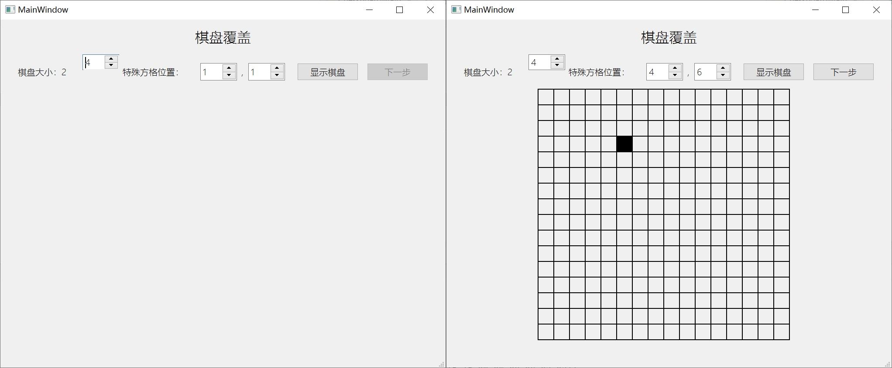
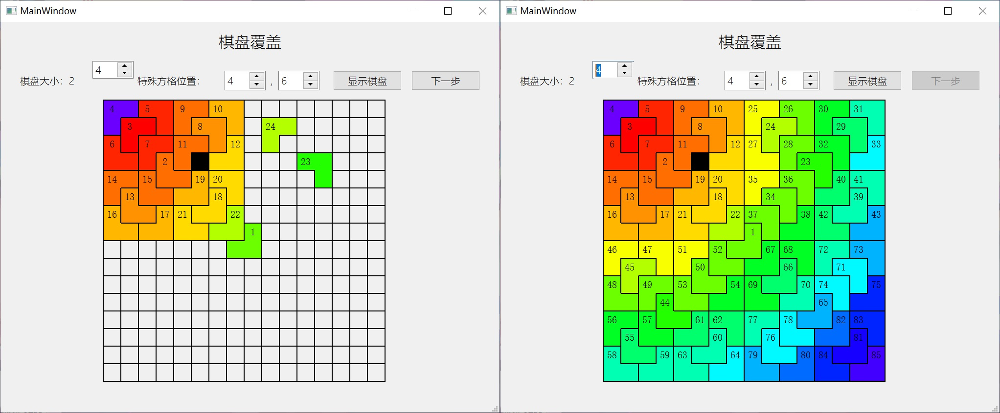

# ChessBoard

visualize divide and conquer chessboard problem

* cover all the chessboard with L-shape tiles, except the defective square

run ChessBoardMain.py

### Input

Input three integers

* k: 2^k is the size of the chessboard

* x: the row number of the special point

* y: the column number of the special point

click "下一步(next)"

